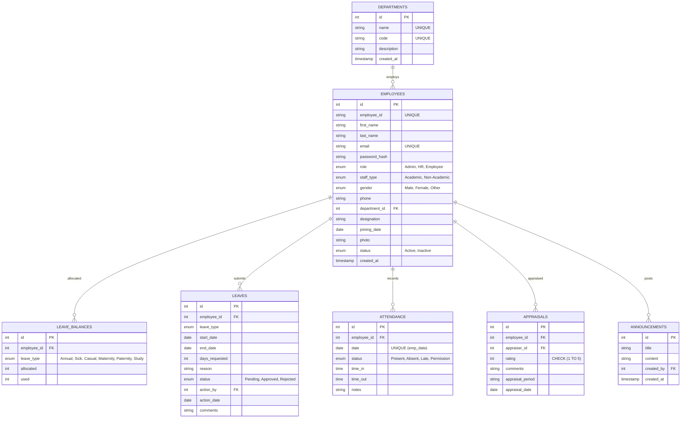
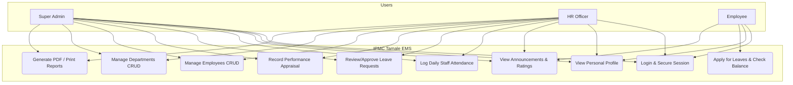
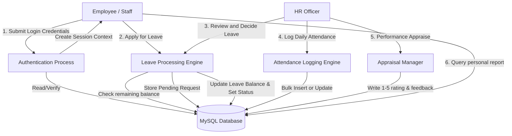

# Web-Based Employee Management System (EMS)
## IPMC Tamale Campus, Ghana
### Final Year Project - System Documentation & User Manual
**Author:** Final Year Undergraduate Student (BSc. Information Technology / Computer Science)
**Date:** March 2025

---

## Table of Contents
1. **Introduction & Project Scope**
2. **System Architecture & Database Design (ERD)**
3. **Functional Specifications & UML Diagrams**
   - 3.1 Use Case Diagram (UML)
   - 3.2 Data Flow Diagram (DFD)
4. **Installation & Deployment Guide**
5. **User Manual & Operations Guide**
   - 5.1 System Administrator Portal
   - 5.2 Human Resource Portal
   - 5.3 Employee Portal

---

## 1. Introduction & Project Scope

The IPMC Tamale Campus Employee Management System (EMS) is a modern, responsive, and secure web application designed to digitize human resources, leave allocation, attendance logging, communications, and performance appraisals.

Currently, administrative operations are performed manually or with fragmented desktop tools (Excel spreadsheets, paper-based application forms, and manual logs). This system serves as a centralized, high-performance database repository that guarantees data security, role-based access, and automated workflow tracking.

### Scope of the System:
- **Target Audience:** Academic and Non-Academic Staff of the IPMC Tamale Campus, Ghana.
- **In-Scope Functions:** Employee registration, passport photo upload, automated institutional ID generation (`IPMC/TAM/[Year]/[Seq]`), department assignments, leave requests, leave tracking, daily attendance monitoring, role-based dashboards, performance rating audits (1-5 scale), and exportable reporting metrics.
- **Out-of-Scope Functions:** Automated payroll calculations (bank processing), biometric attendance devices (hardware integration), and mobile application stores distribution (native app wrapper).

---

## 2. System Architecture & Database Design (ERD)

The application employs an elegant Object-Oriented Programming (OOP) model with PDO (PHP Data Objects) to ensure robust database connectivity and secure parameterized statements (preventing SQL injection).

### Database Entity-Relationship Diagram (ERD)
Below is the database relation schema mapped using Mermaid.



---

## 3. Functional Specifications & UML Diagrams

### 3.1 Use Case Diagram
The three key user roles interact with the system boundaries as shown below:



### 3.2 Data Flow Diagram (DFD Level 1)



---

## 4. Installation & Deployment Guide

### System Requirements:
- **Operating System:** Windows, macOS, or Linux.
- **Web Server:** Apache 2.4+ or Nginx.
- **Database Engine:** MySQL 8.0+ or MariaDB.
- **PHP Interpreter:** PHP 8.1+ (with PDO MySQL and GD extensions enabled).

### Deployment Steps:
1. **Clone/Copy Project Files:**
   Transfer the complete repository to your local web root directory (e.g. `C:/xampp/htdocs/ipmc_ems` or `/var/www/html/ipmc_ems`).
2. **Database Setup:**
   - Open your MySQL terminal or phpMyAdmin.
   - Run the script located in `database/schema.sql` to instantiate the `ipmc_ems` database, create tables, and populate seed records.
   - DDL schema command:
     ```bash
     mysql -u your_user -p < database/schema.sql
     ```
3. **Database Configuration:**
   - The connection configuration is specified inside `classes/Database.php`. Adjust the host, database name, username, and password variables to match your server environment credentials.
4. **Directory Permissions:**
   - Ensure the directory `uploads/` is writeable by the web server process to enable passport photo uploads:
     ```bash
     chmod -R 775 uploads/
     ```
5. **Run the Server:**
   - Start your Apache/Nginx web server or launch the built-in PHP development interpreter:
     ```bash
     php -S localhost:8000
     ```
   - Navigate to `http://localhost:8000/login.php` in your web browser.

---

## 5. User Manual & Operations Guide

### Initial Login Credentials (Seed Data):
- **Administrator Account:**
  - Email: `admin@ipmc.edu.gh`
  - Password: `admin123`
- **Human Resource Account:**
  - Email: `hr@ipmc.edu.gh`
  - Password: `hr123`
- **Employee (Academic Staff):**
  - Email: `yakubu@ipmc.edu.gh`
  - Password: `emp123`
- **Employee (Non-Academic Staff):**
  - Email: `aisha@ipmc.edu.gh`
  - Password: `emp123`

---

### 5.1 System Administrator Portal
Upon authentication, administrators have access to an administrative command board:
- **Employee Directory:** View lists, search names, and perform dynamic filters by role or department.
- **Register New Staff:** Enter employee demographics and upload passport-size photographs. The system automatically computes a unique sequence ID format `IPMC/TAM/[CurrentYear]/XXXX`.
- **Department Administration:** Define institutional faculties and departments. If active employees are assigned to a department, deletion is disabled to prevent database cascading faults.

### 5.2 Human Resource Portal
HR officers can coordinate campus logistics, daily logs, and appraisals:
- **Manage Leaves:** Review pending leave requests. Approve or reject applications and enter textual feedback comments. Approving automatically decrements the respective employee's leave balance.
- **Log Daily Attendance:** Record daily registers of Present (P), Late (L), Absent (A), or Permission (Perm) flags, as well as checking custom timetables and entering shift comments.
- **Performance Appraisals:** Submit periodic professional ratings (1-5 star scale) alongside developmental critique comments.

### 5.3 Employee Portal
Academic and Non-Academic personnel are granted access to a self-service utility:
- **My Dashboard:** Review personal details, view visual leave trackers (used vs. allocated), check recent attendance records, and toggle expanding announcements.
- **Apply for Leaves:** Submit online application requests for Annual, Sick, Casual, Maternity, Paternity, or Study leaves.
- **Performance Metrics:** View history ratings and review feedback logs written by campus directors.
