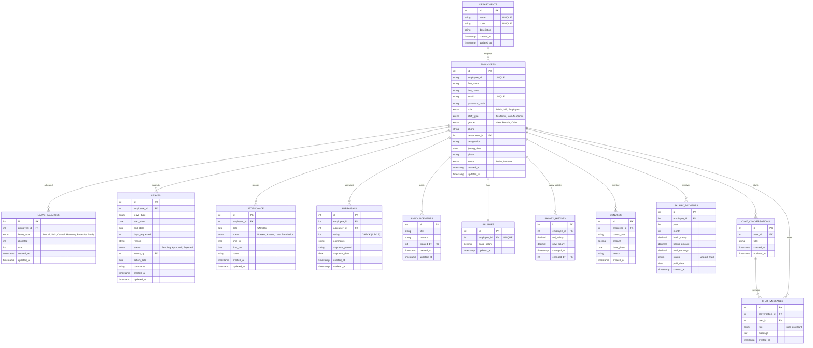

# Web-Based Employee Management System (EMS)
## IPMC Tamale Campus, Ghana
### Final Year Project - System Documentation & User Manual
**Author:** Final Year Undergraduate Student (BSc. Information Technology / Computer Science)
**Date:** March 2025

---

## Table of Contents
1. **Introduction & Project Scope**
   - 1.1 In-Scope & Out-of-Scope Functions
   - 1.2 Core System Capabilities
2. **System Architecture & Database Design (ERD)**
   - 2.1 Database Connection & Parameterized PDO Security
   - 2.2 Comprehensive 13-Table Database Entity-Relationship Diagram (ERD)
3. **Functional Specifications & UML Diagrams**
   - 3.1 Use Case Diagram (UML) with AI & Payroll Modules
   - 3.2 Data Flow Diagram (DFD Level 1) with AI Chat & Secure Tool Calling
4. **Installation & Deployment Guide**
   - 4.1 Local Server Environment Requirements
   - 4.2 Step-by-Step Installation & Initial Setup
5. **User Manual & Operations Guide**
   - 5.1 System Administrator Portal (CRUD, Departments, Salary Base Setup)
   - 5.2 Human Resource Portal (Attendance, Appraisals, Leave Management, Bonuses, Payroll Execution)
   - 5.3 Employee Portal (My Dashboard, Leave Applications, Payslips, Interactive AI Chat Assistant)

---

## 1. Introduction & Project Scope

The IPMC Tamale Campus Employee Management System (EMS) is a modern, responsive, and secure web application designed to digitize human resources, leave allocation, attendance logging, communications, performance appraisals, salary structures, payroll history, and advanced artificial intelligence support.

Currently, administrative operations are performed manually or with fragmented desktop tools (Excel spreadsheets, paper-based application forms, and manual logs). This system serves as a centralized, high-performance database repository that guarantees data security, role-based access, automated workflow tracking, and real-time operational analysis through a conversational AI assistant.

### Scope of the System:
- **Target Audience:** Academic and Non-Academic Staff of the IPMC Tamale Campus, Ghana.
- **In-Scope Functions:** Employee registration, passport photo upload, automated institutional ID generation (`IPMC/TAM/[Year]/[Seq]`), department assignments, leave requests, leave tracking, daily attendance monitoring, role-based dashboards, performance rating audits (1-5 scale), exportable reporting metrics, and:
  - **AI Chat Assistant:** Fully integrated conversational assistant capable of answering user queries by securely executing read-only database tools under strict role-based access controls.
  - **Salary & Payroll Management:** Base salary configuration, salary history auditing, dynamic bonuses logging, and monthly payroll verification (Unpaid/Paid tracking).
- **Out-of-Scope Functions:** Automated payroll calculations (bank processing), biometric attendance devices (hardware integration), and mobile application stores distribution (native app wrapper).

---

## 2. System Architecture & Database Design (ERD)

The application employs an elegant Object-Oriented Programming (OOP) model with PDO (PHP Data Objects) to ensure robust database connectivity and secure parameterized statements (preventing SQL injection).

### Database Entity-Relationship Diagram (ERD)
Below is the comprehensive 13-table database relation schema mapped using Mermaid.



---

## 3. Functional Specifications & UML Diagrams

### 3.1 Use Case Diagram (UML)
The three key user roles interact with the system boundaries as shown below:

```mermaid
graph TD
    subgraph Users
        A[Super Admin]
        H[HR Officer]
        E[Employee]
    end

    subgraph "IPMC Tamale EMS"
        U1(Login & Secure Session)
        U2(View Personal Profile)
        U3(Apply for Leaves & Check Balance)
        U4(View Announcements & Ratings)
        U5(Log Daily Staff Attendance)
        U6(Review/Approve Leave Requests)
        U7(Record Performance Appraisal)
        U8(Manage Employees CRUD)
        U9(Manage Departments CRUD)
        U10(Generate PDF / Print Reports)

        %% New AI Chat Assistant Use Cases
        U11(Access AI Chat Assistant)
        U12(Submit Chat Messages)
        U13(Execute Safe Tool-Calling Queries)
        U14(View Personal Chat History)

        %% New Salaries & Payroll Use Cases
        U15(Manage Base Salaries & History)
        U16(Award and View Bonuses)
        U17(Process and Track Monthly Payroll)
        U18(Download Payslips / Payment History)
    end

    E --> U1
    E --> U2
    E --> U3
    E --> U4
    E --> U11
    E --> U12
    E --> U14
    E --> U18

    H --> U1
    H --> U2
    H --> H4[U4: View Announcements & Ratings]
    H --> U5
    H --> U6
    H --> U7
    H --> U8
    H --> U9
    H --> U10
    H --> U11
    H --> U12
    H --> U13
    H --> U14
    H --> U15
    H --> U16
    H --> U17
    H --> U18

    A --> U1
    A --> U2
    A --> A4[U4: View Announcements & Ratings]
    A --> U5
    A --> U6
    A --> U7
    A --> U8
    A --> U9
    A --> U10
    A --> U11
    A --> U12
    A --> U13
    A --> U14
    A --> U15
    A --> U16
    A --> U17
    A --> U18
```



---

### 3.2 Data Flow Diagram (DFD Level 1)
The data flows within the system, detailing secure AI tool invocation boundaries and payroll operations, are mapped below:

```mermaid
graph TD
    %% Entities
    Emp[Employee / Staff]
    HR[HR Officer / Admin]
    LLP[External AI LLM Provider]

    %% Processes
    AuthProc[1.0 Authentication Process]
    LeaveProc[2.0 Leave Processing Engine]
    AttenProc[3.0 Attendance Logging Engine]
    AppraisalProc[4.0 Appraisal Manager]
    ChatProc[5.0 AI Chat Assistant Engine]
    SalaryProc[6.0 Salary & Payroll Manager]

    %% Data Stores
    DB[(MySQL Database)]

    %% DFD Flow lines
    Emp -->|Submit Login Credentials| AuthProc
    AuthProc -->|Read/Verify User| DB
    AuthProc -->|Session Context| Emp

    Emp -->|Apply for Leave| LeaveProc
    LeaveProc -->|Check Balance| DB
    LeaveProc -->|Store Pending Request| DB

    HR -->|Review/Decide Leave| LeaveProc
    LeaveProc -->|Update Leave Balance & Set Status| DB

    HR -->|Log Daily Attendance| AttenProc
    AttenProc -->|Bulk Insert or Update| DB

    HR -->|Performance Appraise| AppraisalProc
    AppraisalProc -->|Write 1-5 rating & feedback| DB

    %% AI Chat Flows
    Emp -->|Submit Chat Message| ChatProc
    HR -->|Submit Chat Message| ChatProc

    ChatProc -->|1. Authenticate Conversation & Session Role| DB
    ChatProc -->|2. Send Prompt & Active Tools Meta| LLP
    LLP -->|3. Return Intent or Tool Command JSON| ChatProc

    ChatProc -->|4. If Tool Chosen, Verify Role Restrictions| DB
    ChatProc -->|5. Run Secure Backend PHP Tool| DB
    ChatProc -->|6. Send Database Results to LLM| LLP

    LLP -->|7. Generate Friendly Conversational Text| ChatProc
    ChatProc -->|8. Save User & Assistant Message Logs| DB
    ChatProc -->|9. Render Chat Bubble UI| Emp
    ChatProc -->|9. Render Chat Bubble UI| HR

    %% Salary & Payroll Flows
    HR -->|Update Base Salary & Award Bonuses| SalaryProc
    HR -->|Process Monthly Payroll Payments| SalaryProc
    SalaryProc -->|Log Salary Change History| DB
    SalaryProc -->|Record Bonus Allocation| DB
    SalaryProc -->|Calculate Total Earnings & Insert Payments| DB

    Emp -->|View Payslips & Payment History| SalaryProc
    SalaryProc -->|Fetch Slips & Payments| DB
    SalaryProc -->|Display Pay Slip| Emp
```



---

## 4. Installation & Deployment Guide

### System Requirements:
- **Operating System:** Windows, macOS, or Linux.
- **Web Server:** Apache 2.4+ or Nginx (with rewrite support).
- **Database Engine:** MySQL 8.0+ or MariaDB 10.3+.
- **PHP Interpreter:** PHP 8.1+ (with `pdo_mysql`, `curl`, and `gd` extensions enabled).
- **AI Provider Key:** Optional but highly recommended API key from NVIDIA NIM, Gemini, or OpenAI to unlock complete LLM-driven capability.

### Deployment Steps:
1. **Clone/Copy Project Files:**
   Transfer the complete repository to your local web root directory (e.g. `C:/xampp/htdocs/ipmc_ems` or `/var/www/html/ipmc_ems`).
2. **Environment Secret Setup:**
   - Copy `.env.example` as `.env` inside the repository root.
   - Configure the necessary API keys and base URLs. For example, if utilizing NVIDIA NIM, populate:
     ```env
     NVIDIA_API_KEY=your_nvidia_nim_api_key_here
     NVIDIA_MODEL=meta/llama-3.1-8b-instruct
     NVIDIA_BASE_URL=https://integrate.api.nvidia.com/v1
     ```
3. **Database Setup:**
   - Open your MySQL terminal or phpMyAdmin.
   - Run the script located in `database/schema.sql` to instantiate the `ipmc_ems` database, create tables, and populate seed records.
   - DDL schema command:
     ```bash
     mysql -u your_user -p < database/schema.sql
     ```
4. **Database Configuration:**
   - Database credentials are kept in `classes/Database.php`. Adjust the `$host`, `$db_name`, `$username`, and `$password` parameters to match your database server details.
5. **Directory Permissions:**
   - Ensure the directory `uploads/` is writeable by the web server process to enable passport photo uploads:
     ```bash
     chmod -R 775 uploads/
     ```
6. **Run the Server:**
   - Start your Apache/Nginx web server or launch the built-in PHP development interpreter:
     ```bash
     php -S localhost:8000
     ```
   - Navigate to `http://localhost:8000/login.php` in your web browser.

---

## 5. User Manual & Operations Guide

### Initial Login Credentials (Seed Data):
- **Administrator Account:**
  - Email: `admin@ipmc.edu.gh` | Password: `admin123`
- **Human Resource Account:**
  - Email: `hr@ipmc.edu.gh` | Password: `hr123`
- **Employee (Academic Staff):**
  - Email: `yakubu@ipmc.edu.gh` | Password: `emp123`
- **Employee (Non-Academic Staff):**
  - Email: `aisha@ipmc.edu.gh` | Password: `emp123`

---

### 5.1 System Administrator Portal
Upon authentication, administrators have access to an administrative command board:
- **Employee Directory:** View lists, search names, and perform dynamic filters by role or department.
- **Register New Staff:** Enter employee demographics and upload passport-size photographs. The system automatically computes a unique sequence ID format `IPMC/TAM/[CurrentYear]/XXXX`.
- **Department Administration:** Define institutional faculties and departments. If active employees are assigned to a department, deletion is disabled to prevent database cascading faults.
- **Salary Base Setup:** Define and modify base salaries for each registered staff member. Each base rate alteration is safely captured in `salary_history` logs.

### 5.2 Human Resource Portal
HR officers coordinate campus logistics, daily logs, appraisals, and payroll:
- **Manage Leaves:** Review pending leave requests. Approve or reject applications and enter comments. Approving automatically decrements the respective employee's leave balance.
- **Log Daily Attendance:** Record daily registers of Present (P), Late (L), Absent (A), or Permission (Perm) flags.
- **Performance Appraisals:** Submit periodic professional ratings (1-5 star scale) alongside developmental critique comments.
- **Manage Bonuses & Payroll:**
  - **Add Bonus:** Award performance, annual, or special bonuses (with reasons) to employees.
  - **Execute Monthly Payroll:** View and process unpaid payroll entries. Clicking "Pay" locks the calculated total earnings (Basic Salary + Bonuses accumulated during that month) and records the payment date.

### 5.3 Employee Portal
Academic and Non-Academic personnel are granted access to a self-service utility:
- **My Dashboard:** Review personal details, view leave trackers (used vs. allocated), check recent attendance records, and toggle expanding announcements.
- **Apply for Leaves:** Submit online application requests for Annual, Sick, Casual, Maternity, Paternity, or Study leaves.
- **Performance Metrics:** View history ratings and feedback logs written by campus directors.
- **Payslips & Payments:** Instantly view monthly payslips detailing base salaries, accumulated monthly bonuses, total paid earnings, and precise payout dates.
- **Interactive AI Chat Assistant:**
  - Access the floating conversational widget or the dedicated AI Chat console.
  - Ask natural language questions like: *"How many leave days do I have left?"*, *"What was my rating in Q1?"*, *"Show me my profile details"*, or *"What are the latest announcements?"*.
  - **Strict Security Boundaries:** The AI chat uses robust session isolation. Employees can *never* query or view another employee's records. HR and Admin specific metrics (such as `get_employee_count`, `get_today_attendance`, and department rosters) are blocked automatically if requested by a standard Employee. All user prompts and assistant completions are securely logged in the database per conversation context.
